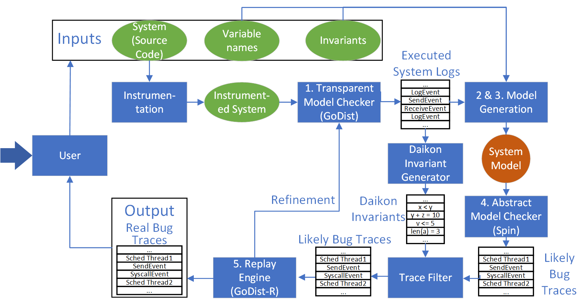

## Introduction

Dara is a hybrid model checker which combines the use of an abstract model
checker with an Implementation Level Model Checker to verify properties of
distributed systems written in Golang.

## Dara Pipeline

The Dara pipeline is highlighted in the following figure



## Overview

As shown in the pipeline, Dara is made up of multiple parts.
This section outlines what role each repository plays in the Dara pipeline.

+ [dara](https://github.com/DARA-Project/dara) : This repository implements the model inference, model refinement, the abstract model checker, and trace filtering parts of Dara.
+ [godist](https://github.com/DARA-Project/GoDist) : A custom modified version of Go v1.10 which provides the necessary interposition to schedule specific Go threads and capture system calls.
+ [godist-scheduler](https://github.com/DARA-Project/GoDist-Scheduler) : This repository implements the concrete state explorer and the replay engine all of which are sub-parts of our concrete model checker.

The following repositories are for specific systems we plan to use Dara on.
+ [BTCD-applications](https://github.com/DARA-Project/BTCD-Applications) : This reposiroty contains information for verifying properties in BTCD, a full node bitcoin implementation in Golang.
+ [Dara-ETCD](https://github.com/DARA-Project/Dara-Etcd) : This repository is a fork of the original ETCD repository which is a Distributed Key-Value store that uses Raft consensus algorithm.

## Installation Instructions

To be able to run Dara, you must have all the following things installed.
It is suggested that you install them in-order.

### Cloning Repos

Go packaging relies heavily on the GOPATH environment variable. Hence, we recommend that
all the repos should be located under the GOPATH root as any other Go library would be.
Thus you should clone all repos as follows (this assumes that you have GOPATH environment variable set) : 

```
   > cd $GOPATH/src
   > mkdir DARA-Project
   > git clone https://github.com/DARA-Project/GoDist.git
   > git clone https://github.com/DARA-Project/dara.git
   > git clone https://github.com/DARA-Project/GoDist-Scheduler.git
```

### Installing GoDist

Installing GoDist(dgo) requires that you have some version of Go (>=1.4) required on your computer.

Assuming, Go 1.10 and its sources are installed at the location "/usr/lib/go-1.10",
execute the following commands to install dgo

```
   > cd $GOPATH/src/DARA-Project/GoDist/src
   > export GOROOT_BOOTSTRAP="/usr"
   > sudo ./make.bash
   > cd ../
   > sudo ln -s bin/go /usr/bin/dgo
```

### Installing dara

Installing the Model Inference Unit (dara) requires you must have docker installed.
Once you have docker installed, you can simply run the following commands

```
   > cd $GOPATH/src/DARA-Project/dara
   > sudo docker build -t dara/1.0 -f ./docker/Dockerfile .
```

### Installing Scheduler

Once you have everything installed, you can install the global scheduler as follows:

```
   > cd $GOPATH/src/DARA-Project/GoDist-Scheduler
   > dgo install
```
